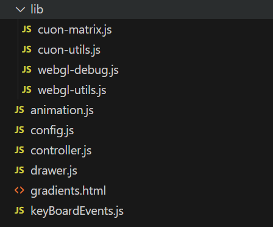
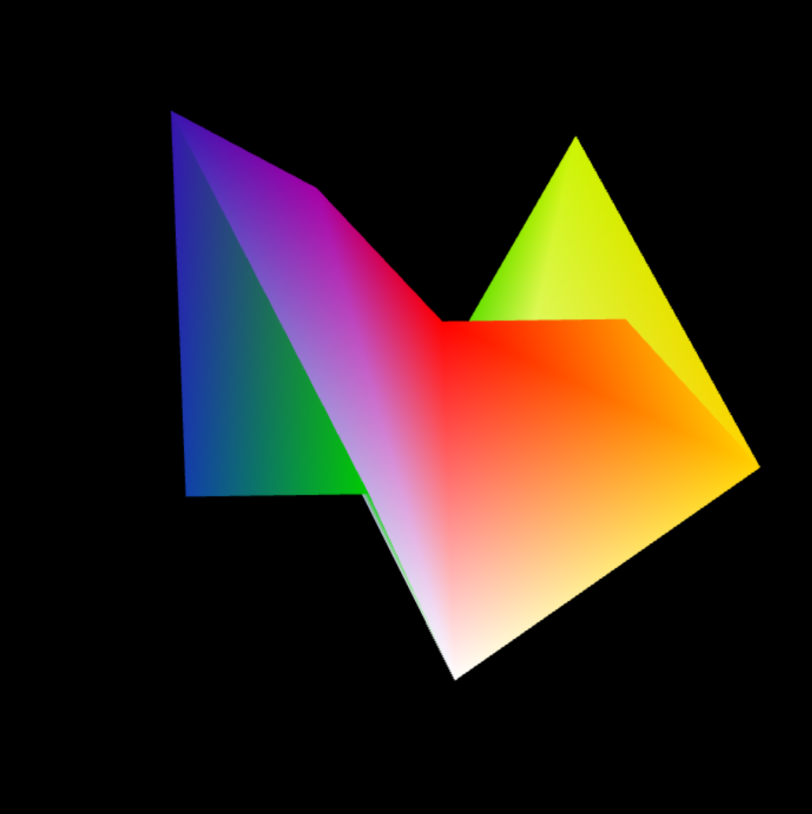
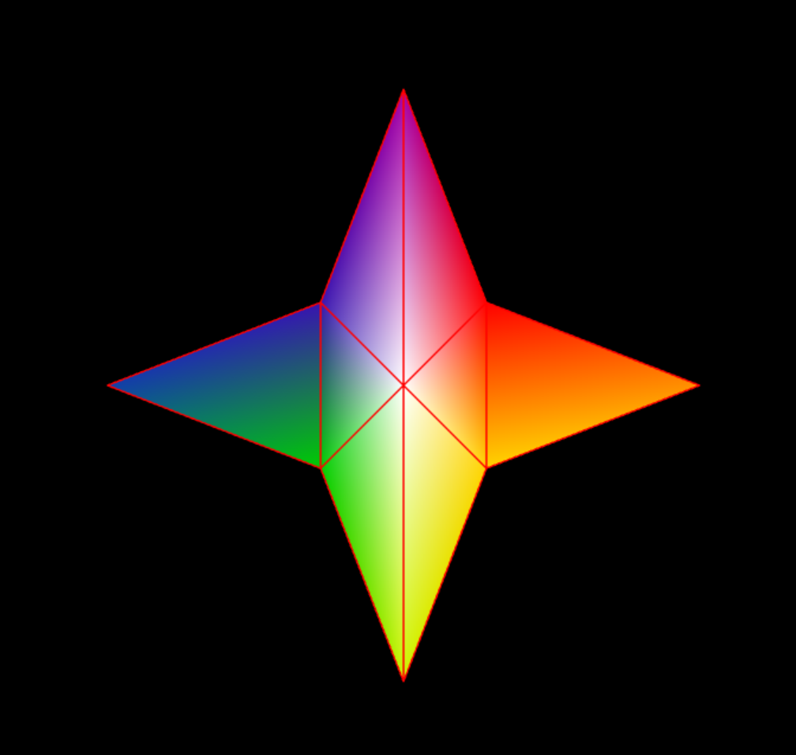

# 			     				计算机图形学PJ2说明文档

​		      22302010019 陈星宇									22302010011 黄宸一

## 一、项目目录及文件说明

项目代码存放于Codes文件夹下，文件组织如下：

lib文件夹：存放库文件，项目已提供，未做改动；

animation.js：处理动画相关的逻辑，包括旋转与缩放；

config.js：配置文件，包含顶点坐标和颜色信息，项目已提供，未做改动；

controller.js：主控文件，定义了顶点着色器和片元着色器，完成坐标转换，并由main函数控制程序进程；

drawer.js：定义了负责绘制多边形框架和多边形的方法；

gradients.html：内联Codes文件夹下各个JS文件，无逻辑处理代码；

keyBoardEvents.js：监听、处理键盘按下事件，处理鼠标拖动网格的行为

## 二、开发及运行环境

​				操作系统：Windows 11

​				浏览器版本：Microsoft Edge 124.0.2478.97 (正式版本) (64 位)

​				IDE：VSCode 1.86

​				NodeJs version: 10.2.3

## 三、运行及使用方法

直接打开html文件即可看见绘制的多边形及其边框。按下“T/t”，即可开启动画，图形以每秒钟45度的速度逆时针，并且在旋转的过程中逐渐变小直到变为原来的百分之20，然后逐渐变大到原本的百分之100，然后再变小如此交替，变换的比例为每秒钟0.2。动画放映期间，按下T可以暂停，再次按下T可以继续播放。在任何时候，用户按下键盘上的B时，可以显示/隐藏网格边框。通过键盘按键E来进入编辑状态，缩放为还原为1.0，旋转角调整为0，此时可以拖拽网格改变图形，但此前的拖动不会被还原（只要图形不在旋转状态，均可以拖拽网格改变图形）。

## 四、项目开发思路

我们小组开发本项目的流程是：先完成边框绘制，再完成旋转与缩放的动画，然后填充渐变色图案，最后完成鼠标拖动处理。各个功能板块间耦合度低，进行了逻辑的抽象，大部分功能可以灵活组合与调整。

绘制边框时，我们采用了4个四边形点与点间连线的方法；填充渐变色图案时，我们的绘制方法是对于每一个四边形，将其拆分为左右（上下）两个三角形，模仿ColoredTriangle.html中的填充方法填充渐变色。

完成动画功能时，我们采用了RotatingTranslatedTriangle.html中类似的方法，逐帧绘制新图形，通过计时器改变缩放大小和旋转角度，用库文件提供的方法获取旋转矩阵和缩放矩阵，在顶点着色器处计算出新的坐标进行绘制。

## 五、遇到的问题和解决方法

1.在刚刚完成动画功能时，我们发现按下T暂停一段时间后，再按下T继续播放，会出现旋转角无法与之前衔接的问题。解决方法：设置计时器，为暂停状态计时，在恢复正常播放后，第一次计算旋转角时减去处于暂停状态的时间即可。

2.完成了填充渐变色图案的功能后，我们发现原来的边框绘制也变成了渐变色，这是因为我们改变片元着色器的gl_FragColor成员变量为varying类型，而非此前的纯红色。解决方法：详细学习片元着色器原理后，我们在绘制边框时把各个顶点颜色定义为纯红色，再次向顶点缓冲区对象写入数据，问题就得到了解决。

## 六、项目可能存在的缺陷

绘制边框的过程可能也可以修改为逐个三角形绘制，这样绘制边框和填充渐变色图案两个功能就有可能合并于同一个函数中，由控制信号指定绘制的具体为哪个部分，减少代码的重复度。在坐标转换上，由于不够熟悉功能和相关特性，顶点坐标依照提供的示例代码转换以实现相关功能，可能存在冗余问题。

## 七、对本课程project的意见及建议

就本PJ而言，任务量适中，且有详细的引导，学习起新的语言和功能并不困难，同时又真正学习到了WebGL编程的不少方法，好评，建议是希望助教或者老师能够在PJ完成后在课上就一些优秀的实现方式给予讲解。

## 八、部分运行效果展示

